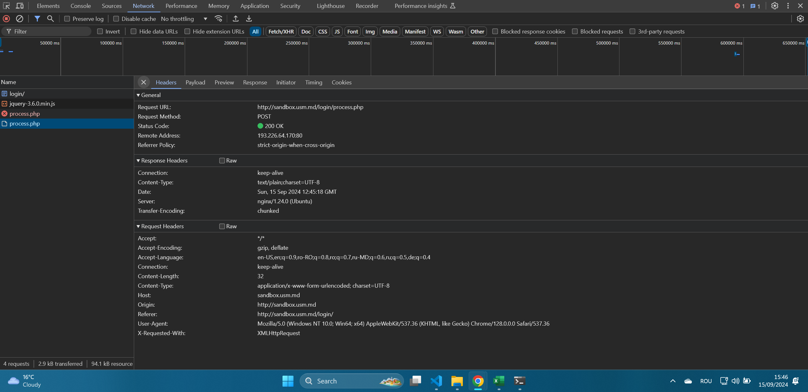

# Raport LL_01 (Lucrare de laborator №1. Bazele HTTP)

## Descriere

Studierea principiilor de bază ale protocolului HTTP.

## Condiții

### Sarcina nr. 1. Analiza cererilor HTTP

1. Accesați site-ul http://sandbox.usm.md/login.
   
2. Deschideți fila Network în instrumentele pentru dezvoltatori ale browserului.
   
3. Introduceți date incorecte pentru autentificare (de exemplu, username: student, password: studentpass).
   
4. Analizați cererile care au fost trimise către server.
   
5. Răspundeți la următoarele întrebări:

- Ce metodă HTTP a fost utilizată pentru a trimite cererea?
  - _Pentru a trimite cererea de autentificare a fost utilizată metoda POST._
- Ce anteturi au fost trimise în cerere?
  - 
- Ce parametri au fost trimiși în cerere?
  - 
- Ce cod de stare a fost returnat de server?
  - _A fost returnat codul de stare (401 Unauthorized)._
- Ce anteturi au fost trimise în răspuns?
  - 

6. Repetați pașii 3-5, introducând date corecte pentru autentificare (username: admin, password: password).
   

### Sarcina nr. 2. Crearea cererilor HTTP

1. Scrieți o cerere de tip GET către server la adresa http://sandbox.com, indicând în antetul User-Agent numele și prenumele dvs.
   `curl -X GET http://sandbox.com -H "User-Agent: Lupu Mihai"`
   
2. Scrieți o cerere de tip POST către server la adresa http://sandbox.com/cars/1, indicând în corpul cererii următorii parametri:

- `make: Toyota`
- `model: Corolla`
- `year: 2020`
  `curl -L -X POST http://sandbox.com/cars/1 -H "Content-Type: text/plain" -d "make=Toyota&model=Corolla&year=2020"`

3. Scrieți o cerere de tip PUT către server la adresa http://sandbox.com/cars/1, indicând în antetul User-Agent numele și prenumele dvs., în antetul Content-Type valoarea application/json, iar în corpul cererii următorii parametri:
   ````{
   "make": "Toyota",
   "model": "Corolla",
   "year": 2021
   }```
   - `curl -X PUT http://sandbox.com/cars/1 -H "User-Agent: Lupu Mihai" -H "Content-Type: application/json" -d "make=Toyota&model=Corolla&year=2020"`
   ````
4. Scrieți unul dintre posibilele răspunsuri ale serverului la cererea anterioară.
   ````HTTP/1.1 200 OK
   Content-Type: application/json
   Server: Apache/2.4.41 (Ubuntu)
   Date: Sun, 15 Sep 2024 12:00:00 GMT
   {
   "message": "Car updated successfully",
   "car": {
   "id": 1,
   "make": "Toyota",
   "model": "Corolla",
   "year": 2021
   }
   }```
   ````

### Sarcina nr. 3. Sarcina suplimentară. HTTP_Quest

1. Trimiteți o cerere de tip POST către server la adresa http://sandbox.usm.md/quest, indicând în antetul User-Agent numele și prenumele dvs. (De exemplu, User-Agent: John Doe).

- curl -X POST http://sandbox.usm.md/quest -H "User-Agent: Lupu Mihai"
- Dupa completarea pașilor cuvantul secret este `secret: JTkfA0UECg0tCFlGUA==`.
